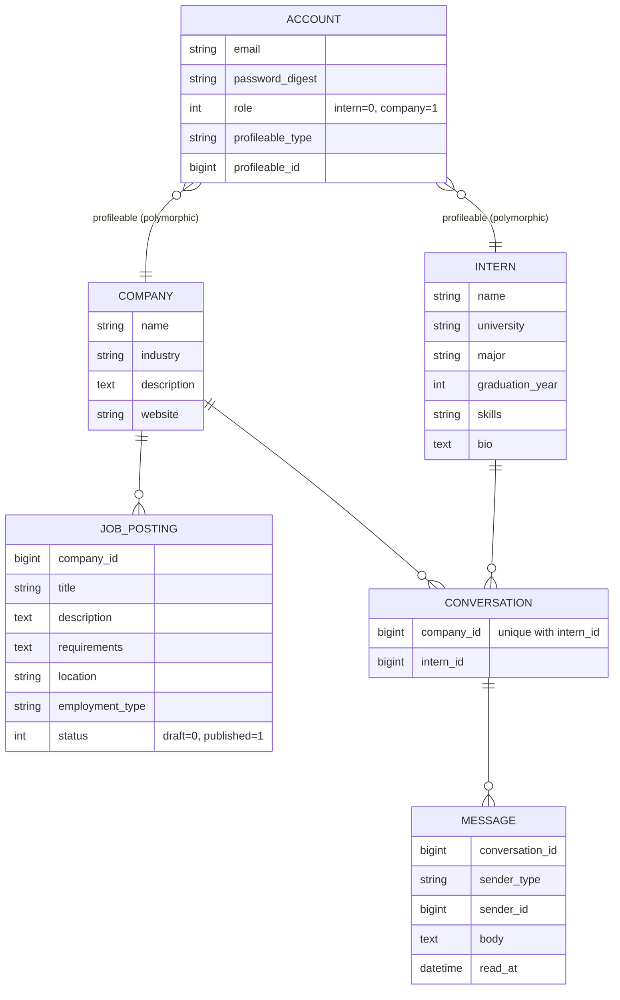

# Scout — インターン生と企業をマッチングするスカウトサービス

株式会社プレックス インターン技術課題の提出物です。

機能を数多く並べるより、一つひとつの設計判断を説明できる状態にすることを優先しました。
実装したのは要件の3点(インターン生の登録 / 企業からのメッセージ / 募集の掲載)です。

## 動かし方

```bash
docker compose up --build

# 別ターミナルで、初回のみ
docker compose exec backend rails db:seed
```

- 画面: http://localhost:3000
- API: http://localhost:3001/api

シード投入後、以下でログインできます(パスワードは全て `password123`)。

| ロール | メールアドレス |
|--------|----------------|
| 企業 | `company@example.com` |
| インターン生 | `intern1@example.com` 〜 `intern3@example.com` |

企業アカウントは募集を2件(公開1・下書き1)と、`intern1` とのスカウト会話を持った状態で始まります。

`.env` は必須ではありません。`JWT_SECRET` などを上書きしたい場合だけ `cp .env.example .env` してください。

## 技術スタック

Rails 7.2 (API-only) + PostgreSQL 16、Next.js (App Router) + TypeScript (strict) + Tailwind CSS、
全体を Docker Compose で起動します。認証は JWT (bcrypt)、API は REST/JSON です。

テストは RSpec が 48 examples、Vitest が 6 tests。

## 設計で迷ったところ

### 認証を `Account` に集約した

一番迷ったのがここです。`Intern` と `Company` はプロフィール項目が全く違うので、
素直に書くならそれぞれのテーブルに email と password_digest を持たせることになります。

ただそうすると、メールの一意性チェック・パスワードのハッシュ化・JWT の発行が2箇所に分かれ、
ロールが増えるたびに増殖します。ログインも「どちらのテーブルを探すか」から始まることになり、
認証と認可が混ざります。

そこで `Account`(email / password_digest / role)を認証の唯一の入口にして、
`Intern` / `Company` は `profileable` という polymorphic 関連でぶら下げる形にしました。
おかげで JWT のペイロードは `account_id` だけで済み、トークン検証がロールを一切知らなくてよくなっています
(`app/services/json_web_token.rb`, `app/controllers/concerns/authenticatable.rb`)。

代償として、プロフィールを触るたびに `current_account.profileable` を一段挟みます。
この規模なら許容範囲と判断しました。

### メッセージを一方通行にしなかった

課題の要件は「企業がインターン生にメッセージを送れる」ですが、
送りっぱなしで返信できないものをスカウト機能と呼ぶのは無理があると思ったので、
`Conversation` + `Message` の会話スレッドにして、インターン生からも返信できるようにしました。

同じ企業と同じインターン生の組み合わせでスレッドが増殖しないよう、
DB の unique index と `find_or_create_by!` の両方で担保しています。
何度スカウトボタンを押しても会話は1本のままです。

`Message` の `sender` は polymorphic で、`Intern` か `Company` を指します。

### 認可は gem を入れずに書いた

Pundit のようなポリシーフレームワークは入れず、コントローラの `before_action` に直接書いています。
エンドポイントがこの数なら、抽象化を挟むより「読めばわかる」方が安いと判断しました。

見ているのは2種類です。

- ロール: 企業だけができる操作(インターン一覧、募集作成、会話開始)
- 所有権: 自分のプロフィールか / 自社の募集か / その会話の参加者か

違反はすべて 403 で返します。ここは request spec でロール別に 200 / 403 / 404 を検証していて、
テストで一番厚くしたのもこの部分です。

### JWT を localStorage に置いている(本番なら変える)

フロントは JWT を `localStorage` に保存して `Authorization: Bearer` で送っています
(`frontend/src/lib/auth.tsx`)。**XSS で盗まれる保存場所**であり、本番なら httpOnly Cookie か
BFF 経由にすべきところです。

CSRF 対策や SameSite の考慮を持ち込まず、セッション周りを単純に保つことを優先して
この形にしました。安全だと思って選んだわけではない、という点だけ明記しておきます。

## ドメインモデル



`MESSAGE.sender` は `Intern` か `Company` を指す polymorphic なので、図の表現は概念的なものです。

## API

すべて `/api` 配下。認証が要るものは `Authorization: Bearer <JWT>` を要求します。

| メソッド | パス | 認可 |
|----------|------|------|
| POST | `/auth/register` | 不要 |
| POST | `/auth/login` | 不要 |
| GET | `/me` | 認証済み |
| GET | `/interns` | 企業のみ |
| GET | `/interns/:id` | 企業のみ |
| PATCH | `/interns/me` | インターン本人 |
| GET | `/job_postings` | 公開(published のみ) |
| GET | `/job_postings/:id` | 公開。下書きは所有企業のみ(他は 404) |
| GET | `/companies/me/job_postings` | 企業のみ(自社の下書きも含む) |
| POST | `/companies/me/job_postings` | 企業のみ |
| PATCH / DELETE | `/job_postings/:id` | 所有企業のみ |
| GET | `/conversations` | 認証済み(自分が参加するもののみ) |
| POST | `/conversations` | 企業のみ。既存があればそれを返す |
| GET / POST | `/conversations/:id/messages` | 参加者のみ |

## テスト

```bash
docker compose exec backend bundle exec rspec    # 48 examples, 0 failures
docker compose exec frontend npm run test        # 6 passing
docker compose exec frontend npm run build       # 型チェックを兼ねる
```

バックエンドはモデルのバリデーション/関連と、request spec を書いています。
request spec は認可の境界(誰が 403 になり、下書きが誰から見えないか、トークンが無いと 401 か)を
重点的に見ています。非参加者が会話を **読めない** だけでなく **書き込めない** ことも確認しています。

フロントは API クライアント、認証コンテキスト、登録フォーム、それと `useApi` フックのテスト。
`useApi` のものは、リロード直後にトークン未確定の 401 が残って
「読み込みは成功しているのにエラー画面が出る」不具合を踏んだので、その回帰テストです。

E2E(Playwright 等)とメッセージ画面のコンポーネントテストは書けていません。

## ディレクトリ

```
backend/    Rails API。controllers/api, models, serializers, services, spec
frontend/   Next.js。src/app(画面), src/lib(api・auth・hooks), src/types
docs/       design.md(着手前に書いた設計メモ)
```

## できていないこと

- **検索・絞り込み** — インターン一覧にも募集一覧にも無し
- **ページネーション** — 一覧系は全件返しているので、件数が増えると破綻する
- **ログインのレート制限** — bcrypt のみで、ブルートフォース対策は入れていない
- **既読** — `messages.read_at` はあるが、既読化もリアルタイム反映も未実装
- **企業のプロフィール編集** — インターン生は `PATCH /interns/me` で編集できるが、企業側は用意していない。
  設計時は入れる想定だったが、優先度を下げた
- **型の自動生成** — `frontend/src/types` は手書き。本来は OpenAPI から生成してズレを防ぎたい
- **httpOnly Cookie** — 前述の localStorage の件

`docs/design.md` は着手前に書いたもので、実装との差分は上記の企業プロフィール編集を落としたことと、
`GET /companies/me/job_postings` を後から足したことの2点です。
